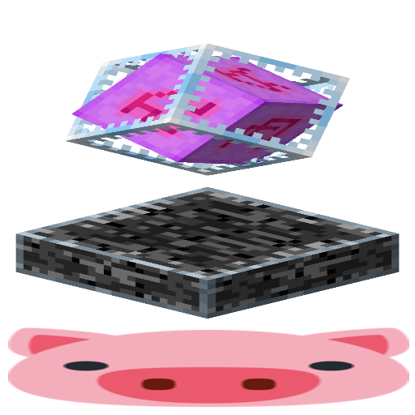

# HCsCR

Remove your end crystals before the server even knows you hit 'em!

## Downloads

- [GitHub Releases](https://github.com/VidTu/HCsCR/releases)

## Dependencies

- Fabric Loader, Quilt Loader, Forge, or NeoForge
- Minecraft (1.16.5, 1.17.1, 1.18.2, 1.19.2, 1.19.4, 1.20.1, 1.20.2, 1.20.4,
  1.20.6, 1.21.1, 1.21.3, 1.21.4, 1.21.5, 1.21.8, 1.21.10, or 1.21.11)
- **Fabric/Quilt only**: [Fabric API](https://modrinth.com/mod/fabric-api) or
  [QFAPI/QSL](https://modrinth.com/mod/qsl) (*Required*)
- **Fabric/Quilt only**: [Mod Menu](https://modrinth.com/mod/modmenu)
  (*Optional*)

## About

Crystal PvP has become a pretty popular combat mode in Minecraft. Crystals
themselves were never designed to be used in combat. Because of this, a client
ping (latency) plays a significant role in a crystal PvP fight, affecting how
fast you can spam. This mod helps to reduce (but does NOT fully remove) the ping
factor from crystal PvP fights. This is commonly called a *client-side crystal
optimizer* mod. It also removes the ping factor for PvP with anchors, though
the ping doesn't play a big role in anchor fights, and it might even be
beneficial to have high ping in these fights. This is not the only crystal
optimizer mod available, but it's the most configurable out there.

*Note*: A server-side crystal optimizer plugin (not this mod) is much more
effective. Consider checking the `/fastcrystals` command or similar commands
on your server. Ask the admins to install one if the command doesn't exist.

## FAQ

**Q**: I need help, have some questions, or have some other feedback.  
**A**: You can join the [Discord server](https://discord.gg/Q6saSVSuYQ).

**Q**: Where can I download this mod?  
**A**: [GitHub Releases](https://github.com/VidTu/HCsCR/releases).
You can also find unstable builds at
[GitHub Actions](https://github.com/VidTu/HCsCR/actions).
You'll need a GitHub account to download these.

**Q**: Which mod loaders are supported?  
**A**: Fabric, Forge, and NeoForge are supported. Quilt should work too.

**Q**: Which Minecraft versions are supported?  
**A**: Minecraft 1.16.5, 1.17.1, 1.18.2, 1.19.2, 1.19.4, 1.20.1, 1.20.2, 1.20.4,
1.20.6, 1.21.1, 1.21.3, 1.21.4, 1.21.5, 1.21.8, 1.21.10, and 1.21.11.

**Q**: Which Minecraft versions were previously supported?  
**A**: Previously supported Minecraft versions were
[1.19.3](https://github.com/VidTu/HCsCR/releases/tag/1.0.0) (Fabric/Quilt only),
[1.21.2](https://github.com/VidTu/HCsCR/releases/tag/1.1.1) (Fabric/Quilt only),
[1.21.6/1.21.7](https://github.com/VidTu/HCsCR/releases/tag/2.1.1), and
[1.21.9](https://github.com/VidTu/HCsCR/releases/tag/2.1.3).
**Note**: These versions are *NOT* supported and are included for informational
purposes. They are probably buggy, laggy, and don't have new features.

**Q**: Why support so many Minecraft versions?  
**A**: Because I can.

**Q**: Do I need Fabric API or Quilt Standard Libraries?  
**A**: Yes, you'll need Fabric API for Fabric and QFAPI/QSL for Quilt.
Obviously, you don't need them for Forge or NeoForge.

**Q**: Is this mod open source?  
**A**: [Yes.](https://github.com/VidTu/HCsCR) (Licensed
under [Apache 2.0 License](https://github.com/VidTu/HCsCR/blob/main/LICENSE))

**Q**: Is this mod client-side or server-side?  
**A**: This mod works on the client-side.

**Q**: Is this a hack?  
**A**: It depends on your opinion on what's hack and what's not. This mod
reduces the role that ping (latency) plays in combat with crystals.
Specifically, it does affect how fast the crystals are removed. Crystal
placement is NOT affected. It cannot be affected in a way that's
considered legitimate.

**Q**: Is this designed to be a hack?  
**A**: No.

**Q**: I want to block this mod as a server owner, can I do this?  
**A**: A [plugin channel](https://minecraft.wiki/w/Java_Edition_protocol/Plugin_channels)
called `hcscr:imhere` is registered by this mod. *Beware*: Other mods similar to
this one don't offer a way to block them. Consider investing your time/resources
into an anti-cheat plugin, if you want to block all of them.

**Q**: I've found a bug.  
**A**: Report it [here](https://github.com/VidTu/HCsCR/issues). If you are not
sure whether this is a bug or a simple question, you can join the
[Discord](https://discord.gg/Q6saSVSuYQ). Report security vulnerabilities
[here](https://github.com/VidTu/HCsCR/security).

**Q**: Can I use this in my modpack?  
**A**: Sure. Credit (e.g., a link to the mod's GitHub page) is appreciated but
is not required. Monetization and redistribution are allowed as per the
[Apache 2.0 License](https://github.com/VidTu/HCsCR/blob/main/LICENSE).
*Beware*: This mod may be considered a hack by some people.

**Q**: Why is this mod not on the Modrinth or CurseForge?  
**A**: Modrinth
[says](https://github.com/user-attachments/assets/437df1a1-3331-499c-ac49-6ec114494bd4)
it violates their [rules](https://modrinth.com/legal/rules). CurseForge has a
terrible API and I don't want to deal with it.

**Q**: Why does this mod exist, when there are server-side crystal optimizers?  
**A**: Firstly, this mod was created in 2023 before the server-side crystal
optimizers. Secondly, not every server has a server-side crystal optimizer.
Thirdly, I have updated it in 2025, because I needed to learn the
[Stonecutter](https://stonecutter.kikugie.dev/) preprocessor.
Now it's not hard to maintain, so why not.

**Q**: How fast is it?  
**A**: It should be pretty fast. No precise numbers,
it depends on the ping, server MSPT, etc.

Totally Real™ Reviews From Happy Users

**Q**: How to compile for only one Minecraft version?
I can't stand waiting hours for the project to initialize.  
**A**: Run the `./gradlew` script with `ru.vidtu.hcscr.only` system property
set to the desired `<version>-<loader>` combination, for example:
`./gradlew -Dru.vidtu.hcscr.only=1.16.5-fabric build`.
Note that due to the Stonecutter requirements, the latest
version may still be initialized, because it is the
[VCS Version](https://stonecutter.kikugie.dev/wiki/glossary#vcs-version)
of the HCsCR by design.

**Q**: Why so much yapping in this README?  
**A**: ~~I paid for the whole LLM, I'm going to use the whole LLM.~~
Because writing READMEs (even though I don't use AI except
for grammar checks) is easier than writing actual code.

**Q**: Do you use AI/LLM/Code Generation/Copilot/etc.?  
**A**: Except for the aftermentioned grammar checkers above, no. I use only
the laggiest IntelliJ IDEA inspections based on the buggiest algorithms.
Can't be sure for contributors, but most of the code is written
by the project author. Also I don't care about AI personally.

## License

This project is provided under the Apache 2.0 License.
Check out [NOTICE](https://github.com/VidTu/HCsCR/blob/main/NOTICE) and
[LICENSE](https://github.com/VidTu/HCsCR/blob/main/LICENSE) for more information.

## Credits

This mod is developed primarily by [VidTu](https://github.com/VidTu),
but it wouldn't be possible without:

- [Contributors](https://github.com/VidTu/HCsCR/graphs/contributors).
- [Stonecutter](https://codeberg.org/stonecutter/stonecutter) by
  [KikuGie](https://codeberg.org/KikuGie). (and contributors)
- [Architectury Loom](https://github.com/architectury/architectury-loom) by
  [Architectury](https://github.com/architectury). (and contributors; plus
  upstream [Fabric Loom](https://github.com/FabricMC/fabric-loom)
  by [FabricMC](https://github.com/FabricMC) and contributors)
- [Fabric Loader](https://github.com/FabricMC/fabric-loader) and
  [Fabric API](https://github.com/FabricMC/fabric) by
  [FabricMC](https://github.com/FabricMC). (and contributors)
- [NeoForge](https://github.com/neoforged/NeoForge) by
  [NeoForged](https://github.com/neoforged). (and contributors)
- [Forge](https://github.com/MinecraftForge/MinecraftForge) by
  [Minecraft Forge](https://github.com/MinecraftForge). (and contributors)
- [Mod Menu](https://github.com/TerraformersMC/ModMenu) by
  [TerraformersMC](https://github.com/TerraformersMC). (and contributors)
- [Mixin](https://github.com/SpongePowered/Mixin) by
  [SpongePowered](https://github.com/SpongePowered). (and contributors)
- [Minecraft](https://minecraft.net/) by
  [Mojang](https://mojang.com/).

It also uses [Gradle](https://gradle.org/) and [Java](https://java.com/).

## Development

### Building (Compiling)

#### All Versions (Slower)

To compile all versions of the mod from the source code:

1. Have 8 GB of free RAM, 20 GB of free disk space,
   and an active internet connection.
2. Install Java 25 and dump it into PATH and/or JAVA_HOME.
3. Run `./gradlew assemble` from the terminal/PowerShell.
4. Grab the JARs from the `./build/libs/` folder.

#### One Version (Faster)

To compile one specific (Minecraft) version the mod from the source code:

1. Have 4 GB of free RAM, 5 GB of free disk space,
   and an active internet connection.
2. Install Java 25 and dump it into PATH and/or JAVA_HOME.
3. Run
   `./gradlew -Dru.vidtu.hcscr.only=<version>-<loader> <version>-<loader>:assemble`
   from the terminal/PowerShell.
4. Grab the JAR from the `./build/libs/` folder.

### Developing/Debugging

Run the `./launch <version>`[^1] (e.g. `./launch 1.16.5-fabric`) command to
launch the game client. You can attach a debugger to that process. Hotswap is
supported. "Enhanced" hotswap (class redefinition) and hotswap
agent will work if supported by your JVM.

Switch between the current target (by Stonecutter) versions by using
`./switch <version>`[^2] command. It is discouraged to modify code commented
out by the preprocessor, switch to the version instead.

Reset to the default target before commiting changes
via `./reset`[^3] command to avoid mess.

Running the client via generated tasks (e.g., for IntelliJ IDEA) may work, but
you might need to make some adjustments. Launching the game directly
(without Gradle) might also work, but it is also not supported.

The development environment has stricter preconditions: Mixin checks,
Netty detector, Java assertions, etc. Code with bugs might (and probably will)
fail faster here than in a production environment.

The recommended IDE for development is IntelliJ IDEA (Community or Ultimate)
with the Minecraft Development plugin. This is not a strict requirement,
however. Any IDE/editor should work just fine.

[^1]: This is a shortcut for `./gradlew "<version>:runClient"`.

[^2]: This is a shortcut for `./gradlew "Set active project to <version>"`.

[^3]: This is a shortcut for `./gradlew "Reset active project"`.
