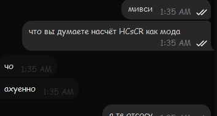

# HCsCR

Удаляй свои кристаллы края, прежде чем сервер даже узнает, что ты ударил их!

## Язык (Language)

- [English 🇬🇧 🇺🇸](README.md)
- **Русский** 🇷🇺

## Скачать

- [GitHub Releases](https://github.com/VidTu/HCsCR/releases)

## Зависимости

- Fabric Loader, Quilt Loader, Forge или NeoForge
- Minecraft (1.16.5, 1.17.1, 1.18.2, 1.19.2, 1.19.4, 1.20.1, 1.20.2, 1.20.4,
  1.20.6, 1.21.1, 1.21.3, 1.21.4, 1.21.5, 1.21.8, 1.21.10 или 1.21.11)
- **Только для Fabric/Quilt**: [Fabric API](https://modrinth.com/mod/fabric-api)
  или [QFAPI/QSL](https://modrinth.com/mod/qsl) (*Обязательно*)
- **Только для Fabric/Quilt**: [Mod Menu](https://modrinth.com/mod/modmenu)
  (*Необязательно*)

## О проекте

PvP на кристаллах ("кпвп" или "cpvp") стало достаточно популярным в Minecraft,
но сами кристаллы никогда не предназначались для боёвки. Из-за этого задержка
(пинг) играет значительную роль в кристалльном бою, влияя на скорость спама.
Этот мод помогает уменьшить (но НЕ убрать полностью) эффекты пинга из
кристалльных сражений. Такие моды как этот обычно называются *клиентским
кристалл-оптимайзером*. Также этот мод убирает эффекты пинга для боёв на якорях,
но пинг там не сильно влияет на ход сражения и может даже изредка помогать. Этот
мод - не единственный кристалл-оптимайзер, но он самый настраиваемый из всех.

*ВНИМАНИЕ*: Серверный кристалл-оптимайзер в виде плагина (т.е. не этот мод)
гораздо более эффективен. Проверьте команду `/fastcrystals` или схожие команды
на вашем любимом сервере. Попросите администраицю установить один из таких
серверных оптимайзеров, если вы не нашли этой или схожей команды.

## ЧаВО (FAQ)

### Для игроков

**В**: Мне нужна помощь, у меня есть вопросы, я хочу связаться с разработчиком.  
**А**: Можете зайти на [сервер Discord](https://discord.gg/Q6saSVSuYQ).
(главный разработчик говорит по-русски)

**В**: Где я могу скачать этот мод?  
**А**: На [GitHub Releases](https://github.com/VidTu/HCsCR/releases).
Нестабильные версии можно скачать на
[GitHub Actions](https://github.com/VidTu/HCsCR/actions).
Для них потребуется аккаунт GitHub.

**В**: Какие загрузики модов поддерживаются?  
**А**: Поддерживаются Fabric, Forge и NeoForge. Quilt тоже должен работать.

**В**: Какие версии Minecraft поддерживаются?  
**А**: Minecraft 1.16.5, 1.17.1, 1.18.2, 1.19.2, 1.19.4, 1.20.1, 1.20.2, 1.20.4,
1.20.6, 1.21.1, 1.21.3, 1.21.4, 1.21.5, 1.21.8, 1.21.10 и 1.21.11.

**В**: Какие версии Minecraft поддерживались раньше?  
**А**: Ранние версии мода поддерживали Minecraft
[1.19.3](https://github.com/VidTu/HCsCR/releases/tag/1.0.0) (только Fabric/Quilt),
[1.21.2](https://github.com/VidTu/HCsCR/releases/tag/1.1.1) (только Fabric/Quilt),
[1.21.6/1.21.7](https://github.com/VidTu/HCsCR/releases/tag/2.1.1) и
[1.21.9](https://github.com/VidTu/HCsCR/releases/tag/2.1.3).
**ВНИМАНИЕ**: Эти версии *НЕ* поддерживаются и показаны тут "для галочки".
Скорее всего они забагованные, лагающие и без нового функционала.

**В**: Зачем поддерживать столько версий Minecraft?  
**А**: Потому что я могу.

**В**: Нужно ли мне ставить Fabric API или Quilt Standard Libraries?  
**А**: Да, вам нужен Fabric API для Fabric или QFAPI/QSL для Quilt.
Очевидно, что они не нужны для Forge или NeoForge.

**В**: Этот мод нужно ставить на клиент или на сервер?  
**А**: Только на клиент. Серверной версии не существует.

**В**: Это чит?  
**А**: Зависит от вашего мнения на тему "что есть чит?". Этот мод уменьшает
роль, которую играет пинг (задержка) в сражениях с кристаллами. Если точнее,
то он влияет на скорость удаления кристаллов. На установку кристаллов мод НЕ
влияет, так как не существует честного (не читерского) способа сделать это.

**В**: Это задумывалось как чит?  
**А**: Нет.

**В**: Я нашёл баг.  
**А**: Отправляйте все баги [сюда](https://github.com/VidTu/HCsCR/issues) на
английском языке (пожалуйста). Если вы не уверены, баг это или нет, вы можете
зайти в [Discord](https://discord.gg/Q6saSVSuYQ). На уязвимости в моде можно
пожаловаться [сюда](https://github.com/VidTu/HCsCR/security).

**В**: Можно я закину это в свою сборку?  
**А**: Конечно. За упоминание (например, ссылкой на GitHub-страницу мода)
будем премного благодарны, но это необязательно. Монетизация и
распространение модпака разрешены на условиях
[Apache 2.0 License](https://github.com/VidTu/HCsCR/blob/main/LICENSE).
*НА ЗАМЕТКУ*: Некоторые люди могут посчитать этот мод читерским.

**В**: Почему этот мод не на Modrinth или CurseForge?  
**А**: Modrinth
[говорит](https://github.com/user-attachments/assets/437df1a1-3331-499c-ac49-6ec114494bd4),
что это нарушает их [правила](https://modrinth.com/legal/rules). У CurseForge
максимально неприятный API и я не хочу с ним разбираться.

**В**: Зачем нужен этот мод, когда есть серверные кристалл-оптимайзеры?  
**А**: Во-первых, этот мод был создан 2023, задолго до серверных оптимайзеров.
Во-вторых, не на каждом сервере есть оптимайзер. В-третьих, я обновил его в
2025, чтобы выучить [Stonecutter](https://stonecutter.kikugie.dev/).
Теперь его легко обновлять, так что почему бы и нет.

**В**: Насколько быстро он спамит?  
**А**: Достаточно быстро. Точных цифр нет, зависит от пинга, лагов сервера и пр.

Абсолютно реальные™ отзывы от счастливых пользователей

### Для разработчиков

**В**: У этого мода открытый исходный код?  
**А**: [Да.](https://github.com/VidTu/HCsCR) (Доступный под лицензией
[Apache 2.0 License](https://github.com/VidTu/HCsCR/blob/main/LICENSE))

**В**: Я - владелец сервера. Я хочу заблокировать этот мод, как это сделать?  
**А**: Мод регистрирует
[plugin channel](https://minecraft.wiki/w/Java_Edition_protocol/Plugin_channels)
под ID `hcscr:imhere`. Старые версии использовали другой канал, но namespace -
всегда `hcscr`. *ВНИМАНИЕ*: Другие моды, схожие с этим, не предлагают способа
себя заблокировать. Попробуйте вложить своё время/ресурсы в плагин анти-чита,
если хотите заблокировать каждый из таких оптимайзеров.

**В**: Как скомпилировать под одну версию Minecraft?
Я устал ждать инициализации проекта часами.  
**А**: Запустите скрипт `./gradlew` с флагом `ru.vidtu.hcscr.only`,
установленным на нужную комбинацию `<версия>-<загрузчик>` например:
`./gradlew -Dru.vidtu.hcscr.only=1.16.5-fabric build`.
Из-за требований Stonecutter, последняя версия может тоже инициализироваться,
из-за того, что она по задумке является 
[версией VCS](https://stonecutter.kikugie.dev/wiki/glossary#vcs-version).

**В**: Чё так много ненужного базара в этом README?  
**А**: ~~Я заплатил за всю LLM, я буду использовать всю LLM.~~
Писать README (даже без AI, его я использую только для грамматики)
проще, чем писать нормальный код.

**В**: Используется ли AI/LLM/Code Generation/Copilot/etc.?  
**А**: Кроме вышеупомянутых инструментов на проверку грамматики, нет. Я
использую самые лаганные инспекции IntelliJ IDEA, основанные на самых
забагованных алгоритмах. Не могу сказать это за контрибьюторов, но большинство
кода пишет автор проекта. А ещё, мне без разницы на использование AI.

**В**: У HCsCR есть публичное API?  
**А**: Неа. Кроме упомянутого plugin channel, никаких публичных API в моде
нет. По этой причине, все классы/пакеты дополнительно помечены
[@ApiStatus.Internal](https://javadoc.io/static/org.jetbrains/annotations/26.0.2/org/jetbrains/annotations/ApiStatus.Internal.html).

**В**: А я могу забить и всё равно использовать этот мод при компиляции?
Что насчёт системы версий [SemVer](https://semver.org/lang/ru/) в этом моде?  
**А**: Можете, на свой риск. Система версий SemVer используется для простоты
(а ещё её под капотом использует Fabric для сравнения версий), но она
используется не по задумке, то есть: мажорная версия увеличивается после
рефакторинга или крупных изменений, минорная версия увеличивается после
небольших изменений, патч-версия увеличивается после баг-фиксов/оптимизаций/
портов на новые версии. У мода нет публичного API, и поэтому несовместимые
изменения исходников/бинарников могут и будут происходить даже между минорными
и патч версиями.

## Лицензия

Этот мод предоставляется под лицензией Apache 2.0 License. Посмотрите файлы
[NOTICE](https://github.com/VidTu/HCsCR/blob/main/NOTICE) и
[LICENSE](https://github.com/VidTu/HCsCR/blob/main/LICENSE) для подробностей
на английском языке.

## Благодарности

В основном этот мод делает [VidTu](https://github.com/VidTu),
но это было бы невозможно, если бы не:

- [Контрибьюторы](https://github.com/VidTu/HCsCR/graphs/contributors).
- [Stonecutter](https://codeberg.org/stonecutter/stonecutter) от
  [KikuGie](https://codeberg.org/KikuGie). (и контрибьюторов)
- [Architectury Loom](https://github.com/architectury/architectury-loom) от
  [Architectury](https://github.com/architectury). (и контрибьюторов, а ещё
  [Fabric Loom](https://github.com/FabricMC/fabric-loom)
  от [FabricMC](https://github.com/FabricMC) и контрибьюторов)
- [Blossom](https://github.com/KyoriPowered/blossom) от
  [Kyori](https://github.com/KyoriPowered). (и контрибьюторов)
- [Fabric Loader](https://github.com/FabricMC/fabric-loader) и
  [Fabric API](https://github.com/FabricMC/fabric) от
  [FabricMC](https://github.com/FabricMC). (и контрибьюторов)
- [NeoForge](https://github.com/neoforged/NeoForge) от
  [NeoForged](https://github.com/neoforged). (и контрибьюторов)
- [Forge](https://github.com/MinecraftForge/MinecraftForge) от
  [Minecraft Forge](https://github.com/MinecraftForge). (и контрибьюторов)
- [Mod Menu](https://github.com/TerraformersMC/ModMenu) от
  [TerraformersMC](https://github.com/TerraformersMC). (и контрибьюторов)
- [Mixin](https://github.com/SpongePowered/Mixin) от
  [SpongePowered](https://github.com/SpongePowered). (и контрибьюторов)
- [Minecraft](https://minecraft.net/) от
  [Mojang](https://mojang.com/).

Используются [Gradle](https://gradle.org/) и [Java](https://java.com/).

## Разработка

### Сборка (Компиляция)

#### Все версии (медленнее)

Для сборки всех версий мода из исходного кода:

1. Требуется 8 ГБ свободной RAM, 20 ГБ свободного места
   на диске и активный доступ к интернету.
2. Установите Java 25 и закиньте её в `PATH` и (или) `JAVA_HOME`.
3. Выполните в терминале/PowerShell команду `./gradlew assemble`.
4. Заберите JAR-ники из папки `./build/libs/`.

#### Одна версия (быстрее)

Для сборки мода для одной версии Minecraft из исходного кода:

1. Требуется 4 ГБ свободной RAM, 10 ГБ свободного места
   на диске и активный доступ к интернету.
2. Установите Java 25 и закиньте её в `PATH` и (или) `JAVA_HOME`.
3. Выполните в терминале/PowerShell команду
   `./gradlew -Dru.vidtu.hcscr.only=<версия>-<загрузик> <версия>-<загрузик>:assemble`
   (например:
   `./gradlew -Dru.vidtu.hcscr.only=1.16.5-fabric 1.16.5-fabric:assemble`
   )
4. Заберите JAR-ник из папки `./build/libs/`.

### Разработка/Отладка/Дебаггинг

Выполните команду `./launch <версия>`[^1] (например, `./launch 1.16.5-fabric`)
для запуска игрового клиента. К этому процессу можно подсоединить отладчик.
Поддерживается хот-свап. "Улучшенный" хот-свап (class redefinition) и
хот-свап агент будут работать, если это поддерживается вашей JVM.

Переключайтесь между текущей версией Stonecutter используя команду
`./switch <версия>`[^2]. Не рекомендуется изменять закомментированный
пропроцессором код, лучше переключитесь на нужную версию.

Перед коммитом изменений, сбросьте версию Stonecutter
командой `./reset`[^3] во избежание бардака в diff.

Запуск клиента через сгенерированные задачи (например, для IntelliJ IDEA), может
быть, работает, но скорее всего вам нужно будет что-то подчинить. Запуск игры
напрямую (в обход Gradle) тоже может заработать, но это тоже не поддерживается.

Среда разработки более строгая, тут есть: проверки Mixin, детектор Netty,
assert-ы Java и т.д. Код с багами скорее всего сломается быстрее тут, чем
на продакшне.

Рекомендуемая IDE для разработки - IntelliJ IDEA (Community или Ultimate)
с плагином Minecraft Development. тем не мене, это не строгое требование.
Любая IDE/редактор будет работать нормально.

[^1]: Сокращение для `./gradlew "<версия>:runClient"`.

[^2]: Сокращение для `./gradlew "Set active project to <версия>"`.

[^3]: Сокращение для `./gradlew "Reset active project"`.
